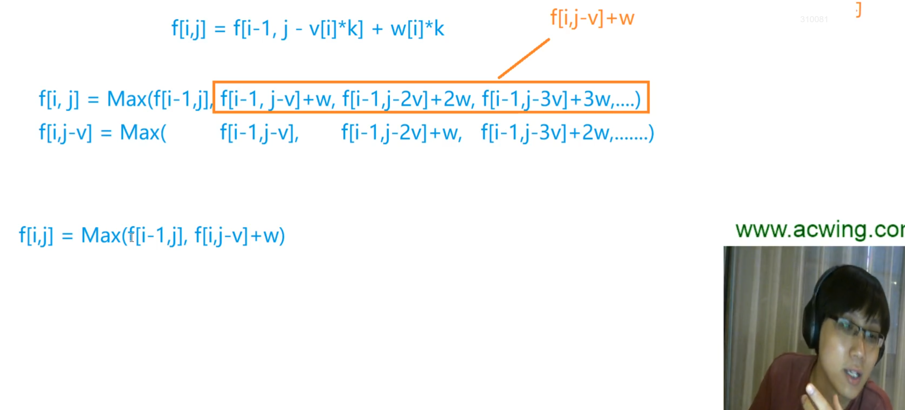

## AC3.完全背包

[3. 完全背包问题 - AcWing题库](https://www.acwing.com/problem/content/3/)


#### 法一：朴素三维DP

​							**time limit exceeded 超时啦！**

```c++
#include<iostream>
#include<algorithm>
using namespace std;

const int N = 1010;
int v[N]; //体积volume
int w[N]; //weight权重 即金额
int dp[N][N];

int main(){
    int n,m;
    cin >> n >> m;
    for(int i = 1;i <= n;i++) cin >> v[i] >> w[i];
    
    for(int i = 1;i <= n;i++){
        for(int j = 1;j <= m;j++){
            for(int k = 0;k * v[i] <= j;k++){
                dp[i][j] = max(dp[i - 1][j],dp[i - 1][j - k * v[i]] + k * w[i]);
            }
        }
    }
    
    cout << dp[n][m] << endl;
    return 0;
}
//时间复杂度约为O(m * m * n)

```


#### 法二：优化为二维dp




```c++
#include<iostream>
#include<algorithm>
using namespace std;

const int N = 1010;
int v[N]; //体积volume
int w[N]; //weight权重 即金额
int dp[N][N];

int main(){
    int n,m;
    cin >> n >> m;
    for(int i = 1;i <= n;i++) cin >> v[i] >> w[i];
    
    for(int i = 1;i <= n;i++){
        for(int j = 1;j <= m;j++){
            dp[i][j] = dp[i - 1][j];
            if(j >= v[i]){
                dp[i][j] = max(dp[i - 1][j],dp[i][j - v[i]] + w[i]);
                
              //dp[i][j] = max(dp[i - 1][j],dp[i - 1][j - v[i]] + w[i]);
                //01背包是这样
                //不能混淆
              
            }
        }
    }
    
    cout << dp[n][m] << endl;
    return 0;
}
```


#### 法三：终极一维！

```c++
#include<iostream>
#include<algorithm>
using namespace std;

const int N = 1010;
int dp[N];

int main(){
    int n,m;
    cin >> n >> m;
    int v; //体积volume
	int w; //weight权重 即金额
    cin >> v >> w;
    
    for(int i = 1;i <= n;i++){
        for(int j = v;j <= m;j++){  //必须从前往后，必须覆盖。 

            dp[j] = max(dp[j],dp[j - v] + w);
            
        }
    }   
    cout << dp[m] << endl;
    return 0;
}
//时间复杂度O(nm)
```

