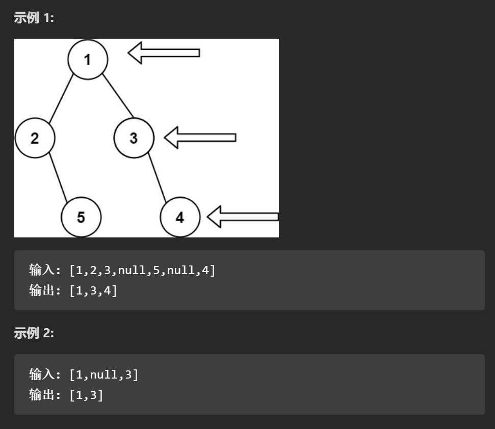

## （1.2）LC199.二叉树的右视图

[199. 二叉树的右视图 - 力扣（LeetCode）](https://leetcode.cn/problems/binary-tree-right-side-view/)



#### 思路：

​		由二叉树的层序遍历进阶到此题，可发现：**输出的结果数组是从上至下层序遍历每层的最后一个元素。**

​		因此，利用层序遍历的思路，先将二叉树进行一遍层序遍历，然后将每层遍历的结果存入vec数组，然后将vec数组的最后一个元素，即vec.back(),存入res数组，即res.push_back(vec.back());

#### 代码：

```c++
class Solution {
public:
    vector<int> rightSideView(TreeNode* root) {
        vector<int> res;
        queue<TreeNode*> que;
        
        if(root == nullptr) return {};  //如果二叉树为空则直接返回{}
        else que.push(root);  //否则将二叉树根节点入队

        while(!que.empty()){
            int size = que.size();  //依然是固定队列的大小
            vector<int> vec;  //存放每层遍历结果的数组
            for(int i = 0;i < size;i++){   //更新队列
                TreeNode* tmp = que.front();
                que.pop();
                vec.push_back(tmp->val);
                
                if(tmp->left != NULL) que.push(tmp->left);
                if(tmp->right != NULL) que.push(tmp->right);
            }
            res.push_back(vec.back()); //将每层最后的元素存入res数组
        }

        return res;
    }
};
```

